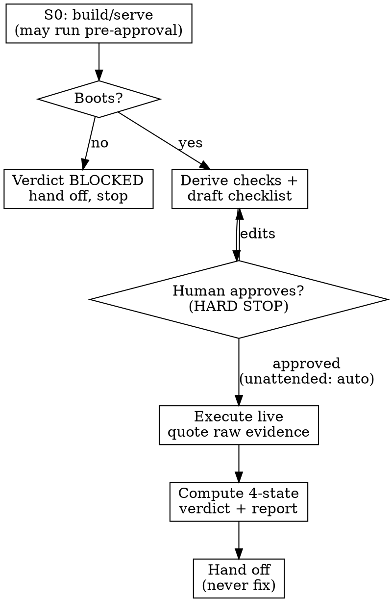

# Smoke Testing

## Overview

Passing unit tests prove the pieces work in isolation. Smoke testing proves the assembled thing turns on. **If you never ran the feature end-to-end with observed evidence, you don't know that it works — you only know your mocks agree with each other.**

A smoke test is **broad and shallow**: exercise every built capability once, live, with one happy path and one high-value failure path each. You are the **smoke tester, not the fixer** — you detect and report; you never edit code.

**Violating the letter of this rule is violating the spirit of this rule.**

## The Iron Law

```
NO "IT WORKS" CLAIM UNTIL THE THING HAS PASSED S0 (BOOT) AND EVERY BUILT SCOPE
ITEM HAS BEEN RUN LIVE WITH RAW OBSERVED EVIDENCE — HAPPY PATH AND ONE
HIGH-VALUE FAILURE PATH.
```

## When to Use

- A feature/change was just built (after superpowers:executing-plans or superpowers:subagent-driven-development), before claiming it is done.
- Before superpowers:verification-before-completion and superpowers:finishing-a-development-branch.
- When an orchestrator dispatches you to verify a freshly-built feature.

**Not for:** unit-level correctness (superpowers:test-driven-development), code quality (superpowers:requesting-code-review), or diagnosing a known failure (superpowers:systematic-debugging). Smoke testing *produces* the feature-level evidence verification-before-completion demands, and *feeds* defects to systematic-debugging.

## Boundary: Detect & Report, Never Fix

You treat the codebase as **read-only**. The only things you write are the report file and ephemeral test data/fixtures. Environment setup (installing deps, setting test env vars, seeding a test DB with synthetic data) is allowed and is NOT a code change.

Found a defect? Record it and hand off. Do not fix it — not even a one-line "obvious" fix. The agent that patches and then re-verifies its own patch is not testing; it is marking its own homework.

## Workflow



**Step 0 — S0 boot gate (mandatory first; may run pre-approval).** Discover and document how to build/serve/login (this fills the Environment block). Run the minimal build/serve commands. Capture evidence the app starts with no critical errors. Booting is non-destructive, so S0 may run before your human partner approves; all other checks wait for it. **S0 fails -> verdict BLOCKED, short-circuit, hand off.** "Couldn't establish a runnable environment" -> BLOCKED. "Ran and behaved wrong" -> FAIL.

**Step 1 — Locate inputs.** Find the feature's spec and plan. Absent or stale -> fall back to `git diff` and warn that coverage is best-effort. Staleness signal: the diff touches surfaces the spec/plan never mention.

**Step 2 — Extract scope items.** Enumerate every built capability from spec requirement sections + plan Task headers (and any distinct user-facing sub-behavior). Tag each with its trace (e.g. `spec section 3`, `plan Task 4`). Then self-count: state how many scope items you extracted and reconcile that count against the spec/plan headers before drafting — a dropped capability is a silent coverage hole.

**Step 3 — Coverage cross-check (four sources).** Map every scope item to >=1 check, and reconcile against **spec, plan, git diff, and memory** (past regressions, known-fragile areas, deferred items, prior smoke reports — via whatever memory mechanism is available). Declare memory status in the coverage map: `memory: consulted` or `memory: unavailable`. Flag anything changed-but-unchecked or memory-flagged-but-unchecked as `UNCOVERED`/`RISK`. Split **Core** (must-run) vs **Extended**. **Proportionality:** breadth scales to the diff's blast radius — a one-line change gets S0 + the surfaces it touches, not a 60-check sweep.

**Step 4 — Draft the checklist.** Instantiate checklist-template.md into `docs/superpowers/smoke-tests/YYYY-MM-DD-<feature-slug>-smoke-test.md`. For each scope item: one happy path + one high-value negative (see Negative taxonomy), each with concrete steps and an **expected observable result**. After drafting, self-critique before the gate: look for coverage gaps, weak/low-value negatives, and negatives that could themselves trip SPEC-MISMATCH; revise.

**Step 5 — Human review gate (HARD STOP).** Present the drafted checklist to your human partner, who edits, re-prioritizes Core/Extended, and approves. Execute nothing beyond S0 before approval. In fully unattended/orchestration mode, proceed automatically.

**Step 6 — Execute live.** Run S0 -> Core -> Extended. For each check, put **raw quoted evidence** in the Actual column and derive Status from a literal match. Use the Prerequisite column so an upstream failure cascades dependents to **BLOCKED** (not FAIL). Write the report file incrementally after each check/group (survives compaction). For 30+ scope items, you may dispatch execution breadth to a subagent while you maintain the report.

**Step 7 — Report.** Compute the four-state verdict, populate Defects (true FAIL only), append the JSON summary. Re-runs after fixes get a new versioned file (`...-smoke-test-vN.md`); a PASS always requires fresh evidence from the current build, never a prior run's.

**Step 8 — Hand off.** BLOCKED/FAIL -> hand the report to superpowers:systematic-debugging (or back to the caller); no fixes. PASS/PASS-WITH-GAPS -> hand to superpowers:verification-before-completion. The report path + verdict is the contract.

## Evidence Discipline (anti-gaming)

The `Actual` column holds **raw quoted output** — response body, HTTP status line, console excerpt, screenshot description. `Status` is **derived**: a check is PASS only if the quoted Actual literally contains the observable in Expected. Never infer, summarize, or write "looks like it worked." Cannot observe it? That is **BLOCKED** or **FAIL** with the exact observation recorded — never a guessed PASS. Fabrication is forbidden.

## When Observed Behavior Contradicts the Spec (SPEC-MISMATCH)

If a check's observed behavior contradicts the spec but looks intentional — the implementation may be correct and the spec stale — do **not** auto-record a defect. Mark the check **PENDING-HUMAN**, quote both the spec expectation and the observed behavior, and flag `SPEC-MISMATCH` for human adjudication. The human decides whether the code or the spec is wrong.

## Negative Taxonomy (pick the one highest-value failure path)

| Surface | Representative negative |
|---------|-------------------------|
| Auth endpoint | expired / missing / malformed token -> 401, no stack trace |
| Form input | empty required / wrong type / oversized -> clear validation error |
| Resource fetch | nonexistent id -> graceful 404, no crash, no data leak |
| File upload | wrong MIME / zero-byte / oversize -> rejected cleanly |
| CLI | missing required flag / conflicting flags -> usage error, non-zero exit |
| Destructive / irreversible action | unauthorized or unconfirmed -> blocked |

Smoke is not an exhaustive negative matrix. One sharp negative per item; deeper matrices belong to TDD/integration suites.

## Four-State Verdict

- **PASS** — all executed checks passed with evidence; Core coverage complete; no UNCOVERED high-risk items; nothing pending-human.
- **PASS-WITH-GAPS** — all executed checks passed with evidence, but UNCOVERED items remain, or human-only checks are PENDING-HUMAN, or memory was unavailable.
- **FAIL** — >=1 check has evidence of wrong behavior (not blocked upstream). Defects populated.
- **BLOCKED** — S0 or a critical environment/tool failure prevented meaningful observation, or too many checks are blocked upstream.

## Test Data, Secrets & Live-UI

- Prefer ephemeral/synthetic data and isolated test users. State-mutating checks document setup + teardown (or use rollback). Note non-idempotent checks.
- **Secrets/PII:** never write real credentials, tokens, cookies, or user PII into the report/evidence. Redact tokens in repro commands; reference credentials by name; scrub screenshots.
- **Live-UI / browser checks -> Chrome DevTools MCP (`chrome-devtools-mcp`) by default** (navigate, screenshot, console). If it is unavailable, mark UI-dependent checks **BLOCKED** — do **not** silently skip and do **not** fall back to the Playwright MCP.

## Red Flags — STOP

- "Unit tests pass / it compiled / build is green, so it works" — you have not run the feature.
- Inferring PASS from a 200 or a clean console without quoting the matching evidence in Actual.
- Treating a BLOCKED check as a silent pass.
- Skipping S0, or treating "won't boot / won't install" as not your problem.
- "I'll just spot-check the happy path."
- "The change was trivial."
- "I found the bug, I'll just quickly fix it" -> No. Record it, hand off. You are the smoke tester, not the fixer.
- Writing real secrets or PII into the report.

## Rationalizations

| Excuse | Reality |
|--------|---------|
| "Unit tests are green" | Units pass in isolation with mocks. Smoke proves the assembled thing turns on. |
| "It compiled" | Compiling is not running. Run it. |
| "Demo is in 10 minutes" | A feature that won't boot is BLOCKED, not done. Reporting that is the fastest path. |
| "The fix is one line" | Tester is not fixer. Record the defect and hand off. |
| "Status 200, good enough" | Quote the body. PASS requires the observable, not just a status code. |
| "Tool's not available, I'll skip the UI checks" | Unavailable tool -> BLOCKED, not skipped. |
| "It's a trivial change" | Trivial changes break integration. S0 + touched surfaces, always. |

## Quick Reference

1. S0 boot (may run pre-approval) -> fail = BLOCKED, stop.
2. Locate spec+plan (else diff + warn).
3. Coverage cross-check: spec, plan, diff, memory -> declare memory status, flag UNCOVERED, mark Core/Extended.
4. Draft checklist (happy + one negative per item) -> `docs/superpowers/smoke-tests/...`.
5. Human approves (HARD STOP; unattended = auto).
6. Execute live, raw quoted evidence, Status derived, dependents BLOCKED, write incrementally.
7. Four-state verdict + Defects + JSON summary.
8. Hand off — never fix.

**Template:** see checklist-template.md in this skill directory.
